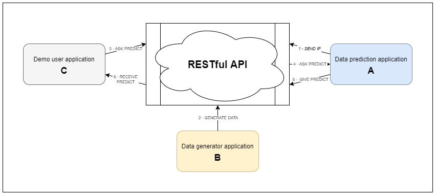

# RESTful API : Application tutorial

This document is a tutorial to use the edge computing API: RESTful API. In the following, you will be shown how to use the API, how to create an application to communicate with the API and how to communicate with the API to get the results of an application.

## Introduction
For this tutorial, we will take the following case: 

*Once the **API** is launched, a data prediction **Application A** will start and report its presence on the network to the **API** and a data generation **Application B** will send a set of data to the **API**. Finally, a **test user C**, will ask the **API** to launch **Application A** and return its prediction based on the data sent by **Application B**.*



## Installation
First downlaod, install and run the **API** : https://github.com/llucbono/Edge_v3
```bash
docker-compose -f local.yml up
```
Then install and run the data prediction application **A**:
```bash
docker build -t app_demo_prediction .
docker run -p 5000:5000 -d app_demo_prediction
```
Go the http://localhost:5000/hi to see if the prediction application **A** is working fine.
## Demo
Then run the data generation application **B** :
```bash
python demoAppDataGenerator.py
```
> The API is now receiving a series of random data at regular intervals.

Then run the test user **C** :
```bash
python demoAppUser.py
```
> The user asks the API for the application's prediction about the data sent just before.

## How build an application to communicate with the API ?
Each of your applications should have the following form:
```python
from appInterface import ApplicationInterface
from flask import Flask
from multiprocessing import Process

URL = "URL WHERE THE API IS RUNNING"
LOCAL_IP = "IP OF THE COMPUTER WHERE THIS APP IS RUNNING"
APPNAME="NAME OF THE APP"

interface = ApplicationInterface(URL)
app = Flask(__name__)

def startCommunication(app):
    server = Process(target=app.run(debug= True, port=5000))
    server.start()    

def stopCommunication(server):
    server.terminate()
    server.join()

@app.route('/send-ip')
def send_ip():
    try:
        interface.postIP(LOCAL_IP,'12','appIP',APPNAME)
        return LOCAL_IP
    except:
        return 'DEBUG: Error sending IP'
        
@app.route('/run-app')
def run_app():
    # YOUR CODE HERE
    res = interface.getListOfMessageFromSensorType("deg") # get the list of data from the sensor type "deg"
    data = res['data']
    toDo(data)

def exit_handler():
    stopCommunication(app)
    interface.deleteAppIPbyName(APPNAME)

def toDo(data):
    # YOUR CODE HERE
    pass

def main():
    try:
        interface.postIP(LOCAL_IP,'12','appIP',APPNAME)
        print('[+] IP send to the API', LOCAL_IP)
    except:
        print('DEBUG: Error sending IP')
    startCommunication(app)

if __name__ == '__main__':
    main()
```

## How call your application using the API ?
Below you can find an example of the user side asking to run an application:
```python
from appInterface import ApplicationInterface
import requests

APPNAME="NAME OF THE APP"
API_URL = "URL WHERE THE API IS RUNNING"
interface = ApplicationInterface(API_URL)

appIP = interface.getAppIPbyName(APPNAME)['data']

s = requests.Session()

_appURL = "http://" + appIP + ":5000/run-app"
resp = s.get(url=_appURL)
print('[+] Message from App:',resp.text)
```